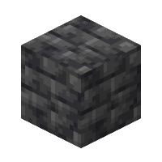

<div align="center">

# DeepslateMC
### A fork of [Leaf](https://github.com/Winds-Studio/Leaf) that adds neat functionalities
<br/>
</div>

## Information
This fork aims to add useful little functionalities to replace plugins that many servers use, like spawn commands, colored signs or the ability to clear the chat.
<br>
All messages are customizable in a separate file. The default ones are in English and you can find translated ones [here](https://pascalpex.de/files/deepslate/translations/).
<br>
You can find a full list of features, commands, permissions, config options and other information in the [wiki](https://github.com/Pascalpex/DeepslateMC/wiki).
## Building
```
./gradlew applyPatches
./gradlew createReobfPaperclipJar
```
## Support
You can find support on our [Discord server](https://discord.gg/BGrhNnVczp)
## Download
You can find the files on our [website](https://pascalpex.de/deepslate/)
