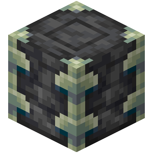

<div align="center">

# DeepslateMC
### A private [Mirai](https://github.com/etil2jz/Mirai) fork for my own Minecraft Server
<br/>
</div>

This fork serves two purposes:
- I learn stuff about [Git](https://git-scm.com/), [Paperweight](https://github.com/PaperMC/paperweight) and Patches
- Small features replace minor plugins

I know that some patches are a mess

## Building
```
./gradlew applyPatches
./gradlew createReobfPaperclipJar
```

## Adding a Patch
```
./gradlew applyPatches
Edit the code
./gradlew build
./gradlew paperclip
Test the code
cd into submodule (api or server)
git add .
git commit -m PATCHNAME
cd into root dir
./gradlew rebuildPatches
Push/PR
```

## Download
**Warning!**: The 1.18.1 Version is still quite experimental

Download: [1.17.1](https://pascalpex.ddns.net/files/deepslate/1.17.1/DeepslateMC.jar) - [1.18.1](https://pascalpex.ddns.net/files/deepslate/1.18.1/DeepslateMC.jar)
